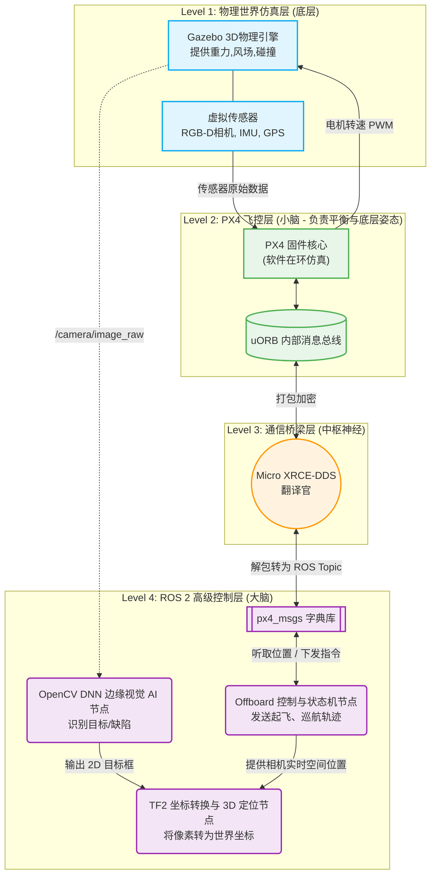
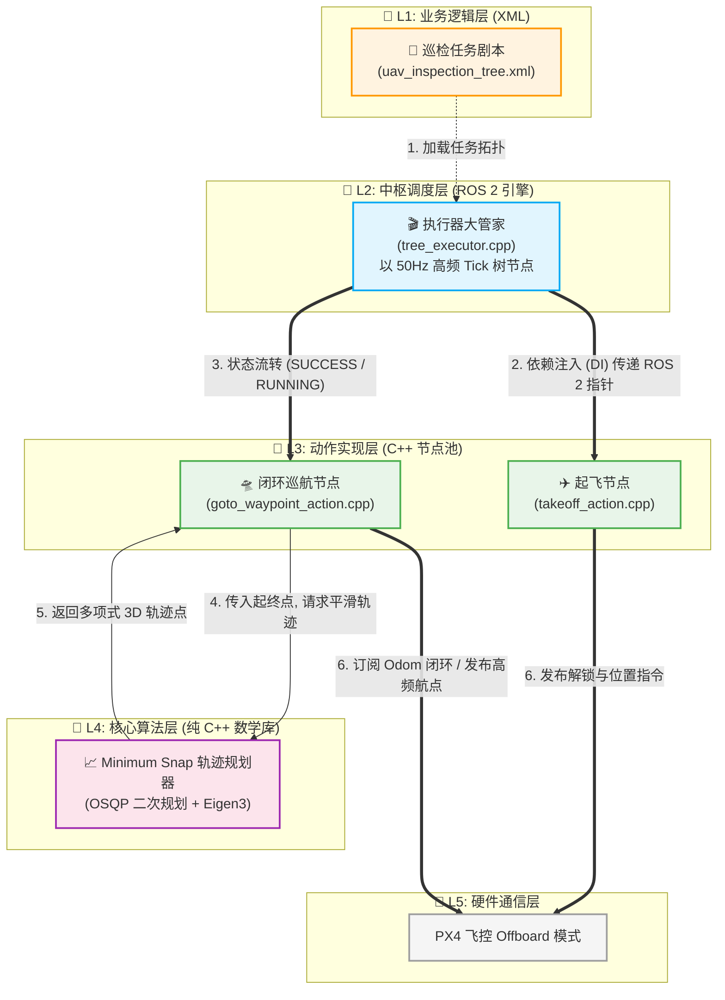
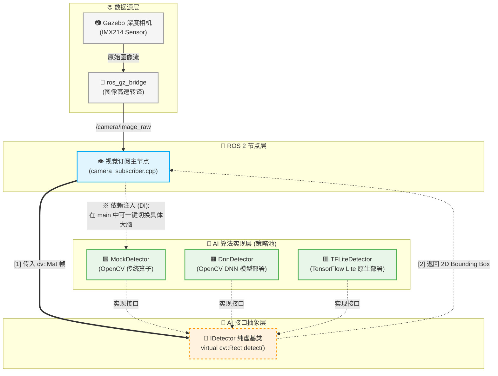

# 🚁 Autonomous UAV Infrastructure Inspection & Defect 3D Localization System 
**(基于边缘AI与ROS 2的无人机自主基建巡检与缺陷3D定位系统)**


## 📖 项目背景 (Project Overview)
在桥梁、高压电塔、风力发电机等高空危险基建的巡检中，传统方式高度依赖飞手遥控，且只能获取二维图像，难以对缺陷（如裂缝、生锈、破损）进行精确的 3D 空间定位。
本项目旨在开发一套**全自主无人机巡检系统**，结合 **ROS 2 Jazzy** 与 **PX4** 飞控，在嵌入式机载平台上利用 **OpenCV DNN (C++)** 引擎进行实时边缘 AI 缺陷检测，并通过 **TF2 动态坐标变换**与**扩展卡尔曼滤波 (EKF)**，将 2D 像素映射并收敛为高精度的 3D 世界坐标，最终自动生成巡检报告。

## 🌟 核心技术亮点 (Technical Highlights)

- **🕹️ 软硬解耦的 DDS 底层通信**：采用 `Micro XRCE-DDS` 桥接 PX4 与 ROS 2，实现高频姿态、里程计与 Offboard 控制指令的低延迟通信与时钟同步。
- **🧠 现代机器人状态机架构**：摒弃面条式代码，引入工业界标准的 `BehaviorTree.CPP`（行为树）精细管理无人机状态（起飞、巡线、目标锁定、悬停、返航）。
- **📈 凸优化轨迹规划 (Minimum Snap)**：不依赖简单的航点直飞，通过 `OSQP` 求解器生成符合无人机动力学约束（最小化加加速度）的平滑 3D 样条轨迹。
- **⚡ 极限算力下的边缘 AI 推理**：针对嵌入式设备（如 Jetson/Raspberry Pi），采用策略模式 (Strategy Pattern) 解耦视觉节点，并使用零第三方依赖的 `OpenCV DNN C++ API` 极速部署 MobileNet-SSD 模型，大幅降低 CPU 占用与推理延迟。
- **🎯 2D 到 3D 的概率融合定位**：维护高频 `World -> Drone -> Gimbal -> Camera` TF 树，通过 3D 射线投射 (Ray-Casting) 反解空间坐标，并引入 `EKF (扩展卡尔曼滤波)` 对连续多帧的观测数据进行概率融合，消除无人机悬停高频抖动带来的定位噪声。

## 🏗️ 系统架构设计 (System Architecture)
- **1.系统整体架构图**

- **2.核心控制与规划架构 (uav_control)**

- **3.视觉与边缘 AI 架构 (uav_vision)**

*(注：此处将在后续补充详细的 ROS 2 Node Graph 架构图)*

- **Simulation**: Gazebo Harmonic
- **Flight Controller**: PX4 Autopilot (SITL)
- **High-Level Control**: ROS 2 Lyrical (BehaviorTree + Trajectory Planner)
- **Perception**: TFLite C++ Inference Node + RGB-D Camera
- **Localization**: TF2 + EKF Fusion Node

## 🗺️ 开发路线图 (Roadmap)

本项目采用敏捷开发模式，逐步实现以下里程碑：

- [x] **Phase 0**: 项目立项，仓库构建与架构设计。
- [x] **Phase 1**: 环境搭建 (Ubuntu 24.04, ROS 2 Jazzy) 与 PX4 SITL + Gazebo 物理仿真环境跑通。
- [x] **Phase 2**: Micro XRCE-DDS 通信链路建立，获取高频里程计与传感器数据，并且编写 C++ Offboard 节点，破解飞控 GCS 断连保护，成功实现代码级解锁起飞。
- [x] **Phase 3**: 复杂状态机与轨迹规划集成 (Agile Sprint)
  - [x] **3.1 架构重构**: 引入 BehaviorTree.CPP，实现 C++ `.hpp/.cpp` 与 ROS 2 节点依赖注入。
  - [x] **3.2 闭环导航**: 实现 `Takeoff` 与 `GoToWaypoint` 节点，完成 3D 空间欧式距离计算与连续航点巡航。
  - [x] **3.3 轨迹优化**: 引入 Minimum Snap 凸优化算法，实现无人机 3D 样条平滑轨迹生成。
- [x] **Phase 4**: 边缘 AI 视觉大脑植入 (Agile Sprint)
  - [x] **4.1 架构解耦**: 定义 IDetector 接口，实现策略模式 (Strategy Pattern)，彻底剥离 ROS 2 与底层 AI 算法。
  - [x] **4.2 视频链路**: 配置 ros_gz_bridge，打通 Gazebo 深度相机到 ROS 2 的无延迟图像流。
  - [x] **4.3 模型部署**: 基于 OpenCV DNN C++ 引擎，零依赖部署 MobileNet-SSD 轻量级模型，实现实时 2D 目标追踪。
  - [x] **4.4 具身闭环**:视觉节点跨域广播 AI 识别坐标，控制端利用 Blackboard 与 ReactiveFallback 机制，实现“发现目标->打断巡航->悬停”的自动追踪。
- [ ] **Phase 5**: TF2 动态坐标树维护，射线投射与 EKF 卡尔曼滤波 3D 定位算法实现。
- [ ] **Phase 6**: 系统级性能 Profiling（延迟、CPU 占用、定位误差分析）与文档完善。

## 🚀 快速启动 (Quick Start / Running Steps)

为了完整运行该具身智能大闭环系统，请开启 5 个独立的终端窗口并依次执行：

**【终端 1：启动 3D 物理仿真】**
```bash
cd ~/ros2_ws/src/uav_inspection
./start_simulation.sh
```
# ⚠️ 注意：等待 Gazebo 界面出现后，需点击左下角的【播放键 (Play)】让物理时间流动！
**【终端 2：启动飞控 DDS 通信桥梁】**
```bash
MicroXRCEAgent udp4 -p 8888
```
**【终端 3：启动 Gazebo 视频专线转译】**
```bash
source /opt/ros/jazzy/setup.bash
ros2 run ros_gz_bridge parameter_bridge /world/default/model/x500_depth_0/link/camera_link/sensor/IMX214/image@sensor_msgs/msg/Image[gz.msgs.Image --ros-args -r /world/default/model/x500_depth_0/link/camera_link/sensor/IMX214/image:=/camera/image_raw
```
**【终端 4：启动 AI 视觉大脑】**
```bash
source ~/ros2_ws/install/setup.bash
# 可选参数：tflite (硬核模型), dnn (OpenCV模型), mock (传统算子)
ros2 run uav_vision camera_node tflite
```
**【终端 5：启动行为树控制中枢】**
```bash
source ~/ros2_ws/install/setup.bash
ros2 launch uav_control bringup.launch.py
```
# 操作提示：在无人机巡航过程中，向 Gazebo 视野内拖入一辆汽车或假人，即可触发视觉打断机制，无人机将紧急制动并悬停于目标上方。

## 🛠️ 依赖与安装 (Prerequisites & Installation)

*(本项目仍在开发中，详细的 CMake 构建指南和 Dockerfile 将在后续版本提供)*

当前开发环境标准：
* OS: Ubuntu 24.04 LTS (Resolute)
* ROS: ROS 2 Lyrical Luth
* PX4: Main branch (SITL)
* Build Tool: Colcon + CMake (C++ 17/20)

## 👤 作者 (Author)
**[huyongji / xinfangshi]**
*   📫 邮箱: [1669147330@qq.com]
*   💼 欢迎联系我交流技术或提供工作机会！
---
*If you like this project, please give it a ⭐!*