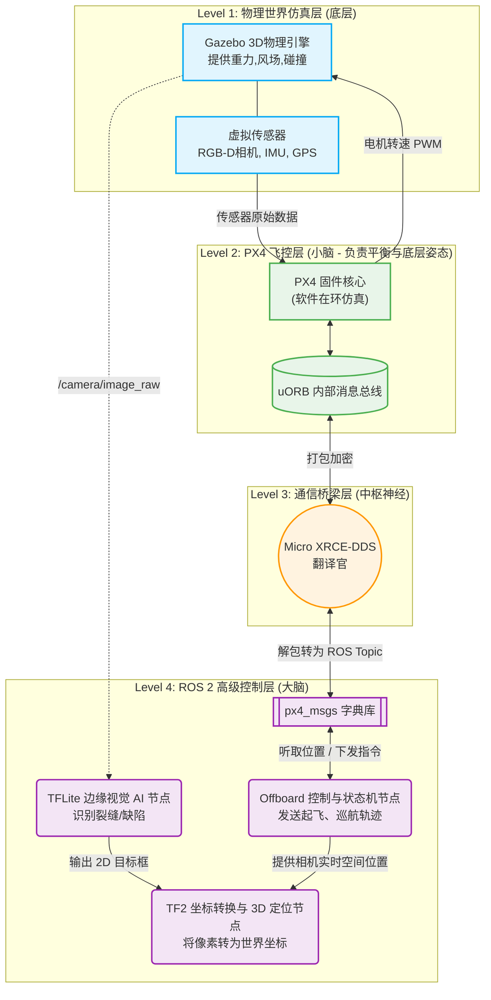

# 🚁 Autonomous UAV Infrastructure Inspection & Defect 3D Localization System 
**(基于边缘AI与ROS 2的无人机自主基建巡检与缺陷3D定位系统)**

## 📖 项目背景 (Project Overview)
在桥梁、高压电塔、风力发电机等高空危险基建的巡检中，传统方式高度依赖飞手遥控，且只能获取二维图像，难以对缺陷（如裂缝、生锈、破损）进行精确的 3D 空间定位。
本项目旨在开发一套**全自主无人机巡检系统**，结合 **ROS 2 Lyrical** 与 **PX4** 飞控，在嵌入式机载平台上利用 **TensorFlow Lite (C++)** 进行实时边缘 AI 缺陷检测，并通过 **TF2 动态坐标变换**与**扩展卡尔曼滤波 (EKF)**，将 2D 像素映射并收敛为高精度的 3D 世界坐标，最终自动生成巡检报告。

## 🌟 核心技术亮点 (Technical Highlights)

- **🕹️ 软硬解耦的 DDS 底层通信**：采用 `Micro XRCE-DDS` 桥接 PX4 与 ROS 2，实现高频姿态、里程计与 Offboard 控制指令的低延迟通信与时钟同步。
- **🧠 现代机器人状态机架构**：摒弃面条式代码，引入工业界标准的 `BehaviorTree.CPP`（行为树）精细管理无人机状态（起飞、巡线、目标锁定、悬停、返航）。
- **📈 凸优化轨迹规划 (Minimum Snap)**：不依赖简单的航点直飞，通过 `OSQP` 求解器生成符合无人机动力学约束（最小化加加速度）的平滑 3D 样条轨迹。
- **⚡ 极限算力下的边缘 AI 推理**：针对嵌入式设备（如 Jetson/Raspberry Pi），使用 `TensorFlow Lite C++ API` 与 `XNNPACK` 代理进行 INT8 量化模型推理，结合 ROS 2 零拷贝机制，极大降低 CPU 占用与推理延迟。
- **🎯 2D 到 3D 的概率融合定位**：维护高频 `World -> Drone -> Gimbal -> Camera` TF 树，通过 3D 射线投射 (Ray-Casting) 反解空间坐标，并引入 `EKF (扩展卡尔曼滤波)` 对连续多帧的观测数据进行概率融合，消除无人机悬停高频抖动带来的定位噪声。

## 🏗️ 系统架构设计 (System Architecture)

*(注：此处将在后续补充详细的 ROS 2 Node Graph 架构图)*

- **Simulation**: Gazebo Harmonic
- **Flight Controller**: PX4 Autopilot (SITL)
- **High-Level Control**: ROS 2 Lyrical (BehaviorTree + Trajectory Planner)
- **Perception**: TFLite C++ Inference Node + RGB-D Camera
- **Localization**: TF2 + EKF Fusion Node

## 🗺️ 开发路线图 (Roadmap)

本项目采用敏捷开发模式，逐步实现以下里程碑：

- [x] **Phase 0**: 项目立项，仓库构建与架构设计。
- [x] **Phase 1**: 环境搭建 (Ubuntu 26.04, ROS 2 Lyrical) 与 PX4 SITL + Gazebo 物理仿真环境跑通。
- [ ] **Phase 2**: Micro XRCE-DDS 通信链路建立，获取高频里程计与传感器数据。
- [ ] **Phase 3**: 引入 BehaviorTree.CPP 构建状态机，实现基于 Minimum Snap 的 3D 轨迹自动生成与 Offboard 控制。
- [ ] **Phase 4**: C++ 环境下 TensorFlow Lite 节点的集成，YOLO/SSD 模型 INT8 量化与实时 2D 缺陷检测。
- [ ] **Phase 5**: TF2 动态坐标树维护，射线投射与 EKF 卡尔曼滤波 3D 定位算法实现。
- [ ] **Phase 6**: 系统级性能 Profiling（延迟、CPU 占用、定位误差分析）与文档完善。

## 🛠️ 依赖与安装 (Prerequisites & Installation)

*(本项目仍在开发中，详细的 CMake 构建指南和 Dockerfile 将在后续版本提供)*

当前开发环境标准：
* OS: Ubuntu 24.04 LTS (Resolute)
* ROS: ROS 2 Lyrical Luth
* PX4: Main branch (SITL)
* Build Tool: Colcon + CMake (C++ 17/20)

## 👤 作者 (Author)
**[huyongji / xinfangshi]**
*   📫 邮箱: [1669147330@qq.com]
*   💼 欢迎联系我交流技术或提供工作机会！
---

*If you like this project, please give it a ⭐!*